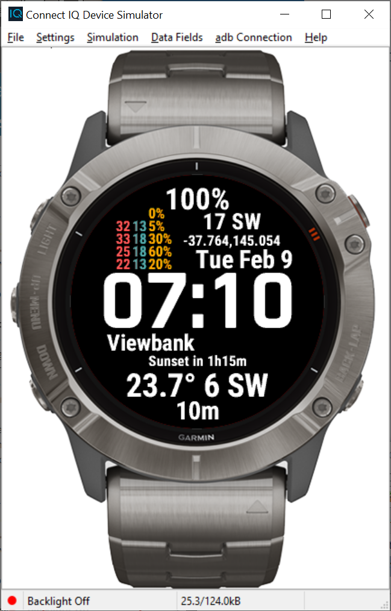

## watchface for fenix 6

A fenix 6 watchface customised for me. Displays BOM data. Inspired by the infocal watchface: https://github.com/RyanDam/Infocal.

#### Information displayed

* Battery
* 5 day weather forecast (max/min/chance of rain) for my home forecast area
* Current wind in St Kilda (knots, bearing)
* Date/time
* Name of closest weather station
* Time to sunset
* Apparent temperature, wind speed (knots), and bearing at closest weather station
* Age of observation from weather station

#### Set up notes

* Eclipse + Garmin SDK required to build the watch face
* For development, need to swap out the Position and Activity APIs (see note in in `source/AndrewWFApp.mc`)
* Watch data requests require TLS, so use nginx/letsencrypt with a proxy pass to the bottle server
